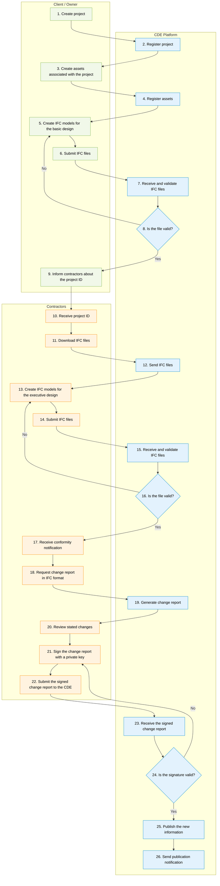

# CDE API Workflow Guide

> **Purpose**  
> This guide explains how to use the CDE API as part of the end-to-end workflow defined in the **Provision of Structured Data for Rigid Pipelines, Components and Accessories in IFC-based Format** Technical Specification. It connects workflow steps, involved actors, and API operations.

## 1. Main references

This guide is based in the following documentations. In case of any discrepancy, the base references should be considered the source of truth for exact paths, payloads and response schemas.
- [Provision of Structured Data for Rigid Pipelines, Components and Accessories in IFC-based Format Technical Specification](http://TODO.insert.ET.link);
- [CDE API swagger](http://cde.certi.api.br:8080/swagger/#/)

## 2. Workflow overview

The diagram below is a simplified representation of the workflow. It shows the relationship between the client/owner, contractors, and the CDE platform.



## 4. Workflow step summary

The table below provides a compact map from business step to API usage.

| Step | Actor | Goal | Relevant API operations | Expected result |
|---|---|---|---|---|
| 1. Create project | Client / Owner | Start a new project in the CDE platform | `POST /api/v1/projects` | Project created and a `project_global_id` returned |
| 2. Register project | CDE Platform | Register the project in the CDE database | `GET /api/v1/projects`, `GET /api/v1/projects/{project_global_id}` | Project available for later steps |
| 3. Create assets associated to project | Client / Owner | Request the creation of the assets that belong to the project scope | `POST /api/v1/assets` | Assets created and linked to the project |
| 4. Register assets | CDE Platform | Register the created assets in the CDE database and make them available in the catalog | `GET /api/v1/assets`, `GET /api/v1/assets/{asset_global_id}` | Assets retrievable by ID |
| 5. Create IFC models for basic design | Client / Owner | Produce the IFC model for the basic design stage |  | IFC model ready to be submitted |
| 6. Submit IFC files | Client / Owner | Upload the IFC file to the CDE | `POST /api/v1/assets/{asset_global_id}/ifc-files` | File received by the CDE |
| 7. Receive and validate IFC files | CDE Platform | Store the file and run validations | `GET /api/v1/assets/{asset_global_id}/ifc-files`, `GET /api/v1/assets/{asset_global_id}/ifc-files/{ifc_global_id}` | Validation status and file metadata available |
| 8. Is valid? | CDE Platform | Accept or reject the uploaded file |  | Workflow either proceeds or loops back |
| 9. Inform contractors about the project ID | Client / Owner | Share the project identifier with contractors |  | Contractors receive `project_global_id` |
| 10. Receive project ID | Contractors | Get the project identifier required for downstream actions |  | `project_global_id` available |
| 11. Download IFC files | Contractors | Generate and download the basic design IFC file from CDE | `POST /api/v1/assets/{asset_global_id}/exports`, `GET /api/v1/assets/{asset_global_id}/exports`, `GET /api/v1/assets/{asset_global_id}/exports/{id}`, `GET /api/v1/assets/{asset_global_id}/exports/{id}/download` | IFC file generated and available for download |
| 12. Send IFC files | CDE Platform | Provide the requested IFC file to the contractor | `GET /api/v1/assets/{asset_global_id}/exports/{id}/download` | File downloaded successfully |
| 13. Create IFC models for executive design | Contractors | Produce the IFC model for the executive design stage |  | Executive design IFC created |
| 14. Submit IFC | Contractors | Upload the executive design IFC file to the CDE | `POST /api/v1/assets/{asset_global_id}/ifc-files` | IFC file submitted |
| 15. Receive and validate IFC files | CDE Platform | Store the file and validate its content | `GET /api/v1/assets/{asset_global_id}/ifc-files`, `GET /api/v1/assets/{asset_global_id}/ifc-files/{ifc_global_id}` | Validation status and file metadata available |
| 16. Is valid? | CDE Platform | Accept or reject the uploaded file |  | Workflow either proceeds or loops back |
| 17. Receive conformity notification | Contractors | Receive confirmation that the submitted model is compliant |  | Contractors know the model was accepted |
| 18. Request change report in IFC format | Contractors | Request a change report based on the current model |  | Change report request created |
| 19. Generate change report | CDE Platform | Create the change report for the submitted model |  | Report generated and available |
| 20. Review stated changes | Contractors | Review the changes described in the report |  | Changes are confirmed by the contractor |
| 21. Sign the change report with a private key | Contractors | Digitally sign the report before submission |  | Signed report created |
| 22. Submit the signed change report to the CDE | Contractors | Send the signed report to the platform |  | Signed report received |
| 23. Receive the signed change report | CDE Platform | Store the signed report and prepare verification |  | Signed document available for validation |
| 24. Is the signature valid? | CDE Platform | Verify the digital signature |  | Workflow either proceeds or loops back |
| 25. Publish the new information | CDE Platform | Publish the approved update in the CDE |  | New information becomes available |
| 26. Send publication notification | CDE Platform | Notify stakeholders that the new information has been published |  | Stakeholders are informed about the publication |

## 5. Detailed step descriptions

### 5.1. Step 1 — Create project

**Actor:** Client / Owner  
**Goal:** create the initial project record.

**API operation**
```http
# Request the creation of a project
POST /api/v1/projects
Content-Type: application/json
```

**Example payload**
```json
{
  "name": "Project Name",
  "description": "Project description",
}
```

**Expected response**
```json
{
    "code": 201,
    "message": "Created",
    "data": {
        "id": "kPaeOOBQYdB8gpDe09Wm72",
        "name": "Project Name",
        "description": "Project description"
    }
}
```

**Important:** `data/id` becomes the **main project identifier** used in later steps. It is also referenced as `project_global_id`.

---

### 5.2. Step 2 — Register project

**Actor:** CDE Platform  
**Goal:** confirm that the project exists and is ready for use.

**API operations**
```http
# List all projects available in CDE
GET /api/v1/projects

# Return the metadata of a project by its identification
GET /api/v1/projects/{project_global_id}
```

**Expected response - ``GET /api/v1/projects/{project_global_id}``**
```json
{
    "code": 201,
    "message": "Created",
    "data": {
        "id": "kPaeOOBQYdB8gpDe09Wm72",
        "name": "Project Name",
        "description": "Project description"
    }
}
```

**Typical usage**
- verify that the project was created;
- retrieve project metadata using the `project_global_id`.

---

### 5.3. Step 3 — Create assets associated with the project

**Actor:** Client / Owner  
**Goal:** create the assets that belong to the project scope.

**API operation**
```http
# Request the creation of a asset
POST /api/v1/assets
Content-Type: application/json
```

**Example payload**
```json
{
  "name": "Asset name",
  "type": "Asset type",
  "description": "Asset description",
  "parameters": {},
  "start_date": "2026-06-11",
  "end_date": "2026-06-11",
  "project_id": "kPaeOOBQYdB8gpDe09Wm72"
}
```

**Important:** `project_id` is the `project_global_id` obtained in **Step 1**.

**Expected response**
```json
{
    "code": 201,
    "message": "Created",
    "data": {
        "id": "3ABvKzu2sRtv0ArxOUSwVy",
        "name": "Asset name",
        "type": "Asset type",
        "description": "Asset description",
        "parameters": {},
        "start_date": "2026-06-11",
        "end_date": "2026-06-11",
        "project_id": "kPaeOOBQYdB8gpDe09Wm72"
    }
}
```

**Important:** `data/id` becomes the **main asset identifier** used in later steps. It is also referenced as `asset_global_id`.

**Expected result**
- the project-asset association is created;
- assets are available for the next workflow steps.

---

### 5.4. Step 4 — Register assets

**Actor:** CDE Platform  
**Goal:** confirm that the assets exists, are related with their correspondent project and are ready for use.

**API operations**
```http
# List all assets available in CDE
GET /api/v1/assets

# Return the metadata of a asset by its identification
GET /api/v1/assets/{asset_global_id}
```

**Expected response - ``GET /api/v1/assets/{asset_global_id}``**
```json
{
    "code": 200,
    "message": "OK",
    "data": {
        "id": "3ABvKzu2sRtv0ArxOUSwVy",
        "name": "Asset name",
        "type": "Asset type",
        "version": 1,
        "description": "Asset description",
        "parameters": {},
        "start_date": "2026-06-11",
        "end_date": "2026-06-11",
        "created_date": "2026-06-11 19:42:57",
        "updated_date": "2026-06-11 19:42:57",
        "project_id": "kPaeOOBQYdB8gpDe09Wm72"
    }
}
```

**Success criteria**
- assets created were available and its metadata can be retrieved using its `asset_global_id`.

---

### 5.5. Step 5 — Create IFC models for basic design

**Actor:** Client / Owner  
**Goal:** produce the IFC model that will be submitted to the CDE.

**Notes**
- The IFC model should be based in the technical specification and contain the basic structure from were contractors should add the executive design.

---

### 5.6. Step 6 — Submit IFC files

**Actor:** Client / Owner  
**Goal:** upload the IFC file to the CDE.

**API operation**
```http
# Upload an IFC file to an asset
POST /api/v1/assets/{asset_global_id}/ifc-files
Content-Type: multipart/form-data
```

**Request body**

- **ifc_file** (file, required)
  - File in IFC (Industry Foundation Classes)
  - Accepted extensions: `.ifc`

**Expected result**
- the file is received;
- an upload identifier is created;
- the processing status starts as queued.

**Expected response**
```json
{
    "code": 201,
    "message": "Created",
    "data": {
        "id": "2rDgusQvH4_g2NXNMucc7f",
        "name": "file.ifc",
        "schema": "IFC4",
        "status": "queued",
        "hash": "03ca67a072b105354a9e207d798146df",
        "file_size": 1504,
        "num_elements": 0,
        "description": "Asset description",
        "created_date": "2026-06-12 12:18:37",
        "asset_id": "3ABvKzu2sRtv0ArxOUSwVy"
    }
}
```

---

### 5.7. Step 7 — Receive and validate IFC files

**Actor:** CDE Platform  
**Goal:** validate the uploaded IFC file and expose the processing status.

**API operations**
```http
# List all IFC files available in the asset
GET /api/v1/assets/{asset_global_id}/ifc-files

# Return the metadata of an IFC file
GET /api/v1/assets/{asset_global_id}/ifc-files/{ifc_global_id}
```

**Expected response - ``GET /api/v1/assets/{asset_global_id}/ifc-files/{ifc_global_id}``**
```json
{
    "code": 200,
    "message": "OK",
    "data": {
        "name": "file.ifc",
        "schema": "IFC4",
        "status": "approved",
        "hash": "03ca67a072b105354a9e207d798146df",
        "file_size": 1504,
        "num_elements": 17,
        "description": "Asset description",
        "created_date": "2026-06-12 12:26:40",
        "updated_date": "2026-06-12 12:26:40",
        "report": {...},
        "progress": "100%",
        "id": "2rDgusQvH4_g2NXNMucc7f"
    }
}
```

**Expected result**
- the uploaded file is visible in the CDE;
- the validation progress and status are available for the uploaded file.

---

### 5.8. Step 8 — Is the file valid?

**Actor:** CDE Platform  
**Goal:** decide whether the workflow can continue.

#### If **yes**
- the workflow proceeds to the contractor notification step.

#### If **no**
- the CDE returns the correspondent status in case of invalid or rejected file;
- the Client / Owner corrects the IFC model;
- the file is resubmitted starting from Step 6.

---

### 5.9. Step 9 — Inform contractors about the project ID

**Actor:** Client / Owner  
**Goal:** communicate the project identifier to the contractors so they can continue the workflow.

**Communication mechanism**  
The communication mechanism between *client / owner* and *contractors* is defined by the *client / owner*.


---

### 5.10. Step 10 — Contractors receive the project ID

**Actor:** Contractors  
**Goal:** receive the project identifier from the client / owner to continue the workflow.

---

### 5.11. Step 11 — Download IFC files

**Actor:** Contractors  
**Goal:** retrieve the IFC file generated by the CDE.

**API operations**
| Method | Endpoint | Description |
|--------|----------|-------------|
| POST | `/api/v1/assets/{asset_global_id}/exports` | Request the generation of an IFC file containing all elements currently in the CDE. |
| GET | `/api/v1/assets/{asset_global_id}/exports` | Retrieve all IFC generation requests. |
| GET | `/api/v1/assets/{asset_global_id}/exports/{id}` | Retrieve information about a specific IFC generation request. |
| GET | `/api/v1/assets/{asset_global_id}/exports/{id}/download` | Download the generated IFC file once it is ready. |

**Step workflow**
- request an IFC export using the first endpoint;
- poll the third endpoint to check the generation status;
- once the file is ready, download it using the fourth endpoint.

---

### 5.12. Step 12 — CDE send the IFC files to contractors

**Actor:** CDE Platform  
**Goal:** send the generated IFC file to the contractors.

**API operations**
```http
# Download an available IFC file
GET /api/v1/assets/{asset_global_id}/exports/{id}/download
```

**Expected response**
- STEP IFC file content.

---

### 5.13. Step 13 — Create IFC models for the executive design

**Actor:** Contractors  
**Goal:** create the executive design model based on the basic design model created by the client / owner.

**Notes**
As with the basic design step, the executive design model must follow the current technical specification.

---

### 5.14. Step 14 — Submit IFC files

**Actor:** Contractors  
**Goal:** submit the executive design IFC file to the CDE.

**API operation**
```http
# Upload an IFC file to an asset
POST /api/v1/assets/{asset_global_id}/ifc-files
Content-Type: multipart/form-data
```

**Request body**
- **ifc_file** (file, required)
  - File in IFC (Industry Foundation Classes)
  - Accepted extensions: `.ifc`

**Expected result**
- the file is received;
- an upload identifier is created;
- the processing status starts as queued.

---

### 5.15. Step 15 — Receive and validate IFC files

**Actor:** CDE Platform  
**Goal:** validate the uploaded IFC file and expose the processing status.

**API operations**
```http
# List all IFC files available in the asset
GET /api/v1/assets/{asset_global_id}/ifc-files

# Return the metadata of an IFC file
GET /api/v1/assets/{asset_global_id}/ifc-files/{ifc_global_id}
```

**Expected result**
- the uploaded file is visible in the CDE;
- the validation progress and status are available for the uploaded file.

---

### 5.16. Step 16 — Is the file valid?

**Actor:** CDE Platform  
**Goal:** decide whether the executive design model can be accepted.

#### If **yes**
- the contractor receives a conformity notification.

#### If **no**
- the CDE returns the correspondent status in case of invalid or rejected file;
- the contractor corrects the IFC model;
- the file is resubmitted starting from Step 14.

---

### 5.17. Step 17 — Receive conformity notification

**Actor:** Contractors  
**Goal:** confirm that the submitted executive design model was accepted by the CDE.

**Implementation note**
TODO

---

### 5.18. Step 18 — Request change report in IFC format

**Actor:** Contractors  
**Goal:** request a report that describes the changes tracked in IFC format.

**Implementation note**
TODO

---

### 5.19. Step 19 — Generate change report

**Actor:** CDE Platform  
**Goal:** generate the change report requested by the contractor in IFC format.

**Implementation note**
TODO

---

### 5.20. Step 20 — Review stated changes

**Actor:** Contractors  
**Goal:** review the generated IFC change report and confirm the changes before signing.

**Expected result**
TODO

---

### 5.21. Step 21 — Sign the change report with a private key

**Actor:** Contractors  
**Goal:** digitally sign the IFC change report before submission, using the private key of an authorized user.

**Implementation note**
TODO

---

### 5.22. Step 22 — Submit the signed change report to the CDE

**Actor:** Contractors  
**Goal:** upload the signed document back to the CDE.

**Implementation note**
TODO

---

### 5.23. Step 23 — Receive the signed change report

**Actor:** CDE Platform  
**Goal:** store the signed document and prepare it for signature validation.

---

### 5.24. Step 24 — Is the signature valid?

**Actor:** CDE Platform  
**Goal:** verify the digital signature.

#### If **yes**
- the workflow continues to publication.

#### If **no**
- the report is rejected;
- the contractor re-signs and resubmits the document, starting from step 21.

---

### 5.25. Step 25 — Publish the new information

**Actor:** CDE Platform  
**Goal:** publish the approved information so it becomes available to the involved parties.

---

### 5.26. Step 26 — Send publication notification

**Actor:** CDE Platform  
**Goal:** notify the involved parties that the new information has been published.

**Implementation note**
TODO

## 6. Additional notes

TODO