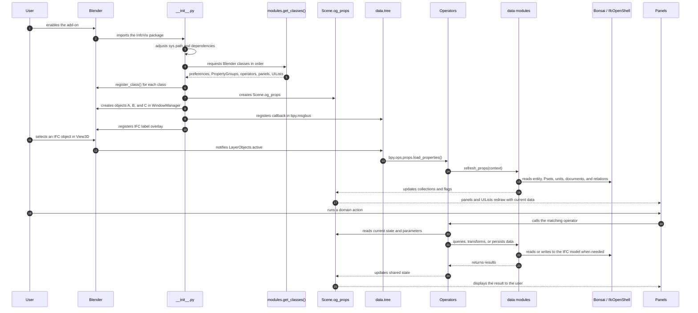

# InfoVis Architecture

InfoVis is a Blender add-on structured as a modular Python package. It combines
View3D interface panels, Blender operators, shared state in `PropertyGroup`s,
data helpers for IFC/bSDD/CDE, and local JSON resources.

## Overview

The application is built around four main blocks:

- `__init__.py`: entry point, add-on metadata, dependencies, preferences,
  and registration lifecycle.
- `modules/`: panels, operators, `PropertyGroup`s, `UIList`s, and state exposed
  to Blender.
- `data/`: support functions for IFC, bSDD, catalog, CDE, trees, local
  dictionaries, and configuration profiles.
- `resources/`: domain JSON files used by the catalog, LI Mapping, analysis,
  units, decomposition views, and IFC types.

Blender classes are registered through `modules.get_classes()`, preserving the
order required by Blender: auxiliary types, `PropertyGroup`s, `OG_Properties`,
operators, and panels.

## Complete Diagram

```mermaid
flowchart TB
    user["User"]

    subgraph host["Blender 5.0 / Bonsai BIM"]
        view3d["View3D<br/>InfoVis tab"]
      addon_prefs["Addon Preferences<br/>CDE URL, token, debug"]
        scene["bpy.types.Scene<br/>Scene.og_props"]
        wm["bpy.types.WindowManager<br/>connection objects A, B, C"]
        msgbus["bpy.msgbus<br/>LayerObjects.active"]
        handlers["bpy.app.handlers.load_post"]
        overlay["Viewport overlay<br/>IFC labels"]
    end

    subgraph entry["Add-on entry point"]
        init["__init__.py<br/>bl_info, sys.path, register, unregister"]
        deps["Dependencies<br/>wheels/ declared in blender_manifest.toml"]
        registry["modules.get_classes()<br/>Blender class registration order"]
    end

    subgraph state["Central state"]
        og["modules/og_properties.py<br/>OG_Properties"]
        dict_state["Dictionary state<br/>classes, properties, bSDD info, IDS"]
        decomp_state["Decomposition state<br/>containers, tree, views, relations"]
        catalog_state["Catalog state<br/>products, types, layers, LI Mapping"]
        props_state["Properties state<br/>Psets, properties, documents, charts"]
        analysis_state["Analysis state<br/>discipline, ObjectType, Pset, property, legend"]
        overlay_state["Overlay state<br/>IFC attributes and label offsets"]
        conn_state["Connection state<br/>IFC connection type"]
    end

    subgraph ui["UI layer - modules/*/panels.py"]
        dictionary_panel["dictionary.Panel_Connect<br/>bSDD, classes, properties, IDS"]
        decomp_panel["decomposition.Panel_Decompositions<br/>IFC tree and ordering"]
        catalog_panel["catalog.Panel_Catalog<br/>products, types, and layers"]
        li_panel["catalog.Panel_LI_Mapping<br/>LI mapping and support tables"]
        analysis_panel["analysis.Panel_Analysis<br/>property-based color mapping"]
        conn_panel["connections.Panel_Connect_Elements<br/>object connections"]
        props_panel["props.Panel_Properties<br/>Psets, documents, table, chart"]
        types_panel["types.Panel_Types<br/>active type and linked elements"]
        settings_panel["settings.Panel_Settings<br/>IFC labels, views, profiles"]
        uilists["UILists<br/>BIM_UL_* by domain"]
    end

    subgraph ops["Command layer - modules/*/operators.py"]
        common_ops["common<br/>expand, collapse, select object, overlay"]
        dictionary_ops["dictionary<br/>load bSDD, properties, info, assign, IDS"]
        decomp_ops["decomposition<br/>load, export, select"]
        catalog_ops["catalog<br/>load products, layers, LI mapping, export LI/QTDS"]
        analysis_ops["analysis<br/>apply colors, reset colors"]
        conn_ops["connections<br/>add connect, disconnect, select object"]
        props_ops["props<br/>load/edit Psets, docs, charts, tables"]
        settings_ops["settings<br/>labels, decomposition views, config profile"]
    end

    subgraph data["Data layer - data/"]
        data_init["data/__init__.py<br/>exports helpers"]
        bsdd["bsdd.py<br/>bSDD REST client"]
        bsdd_dict["bsdd_dictionary.py<br/>local dictionaries and selectors"]
        catalog_data["catalog.py<br/>Catalog, Import_ifc, PropTempl"]
        cde["cde.py<br/>CDE_Api"]
        tree["tree.py<br/>callbacks, refresh, and tree drawing"]
        ifc_utils["ifc_utils.py<br/>Psets, units, products, IFC connections"]
        decomp_views["decomposition_views.py<br/>presets and view persistence"]
        config_profile["config_profile.py<br/>configuration profile export/import"]
    end

    subgraph domain["BIM / IFC model"]
        bonsai["bonsai.tool.Ifc<br/>IfcStore and Blender objects"]
        ifcopenshell["ifcopenshell<br/>IFC model, util.element, api.pset, relations"]
        ifctester["ifctester.ids<br/>IDS export"]
    end

    subgraph resources["Local resources"]
        resource_json["resources/*.json<br/>IFC types, units, catalogs, acronyms"]
        dictionary_json["resources/subsea_*_completo.json<br/>domain dictionaries"]
        decomp_json["resources/decomposition_view.json<br/>decomposition views"]
        li_json["resources/li_mapping.json<br/>LI mapping"]
    end

    subgraph external["External integrations"]
        bsdd_api["buildingSMART bSDD API<br/>api.bsdd.buildingsmart.org"]
        cde_api["CDE API<br/>URL configured in preferences"]
    end

    subgraph support["Support, docs, and release"]
        libs["wheels/<br/>Python packages bundled as wheel files"]
        build["build_release.bat / build_release.sh<br/>generates releases/InfoVis.zip"]
      docs["docs/<br/>Markdown guides and reference"]
        html["graphic.html / layers.html<br/>supporting visualization artifacts"]
    end

    user --> view3d
    user --> addon_prefs

    init --> deps
    init --> registry
    init --> scene
    init --> wm
    init --> msgbus
    init --> handlers
    init --> overlay
    deps --> libs

    registry --> common_ops
    registry --> dictionary_ops
    registry --> decomp_ops
    registry --> catalog_ops
    registry --> analysis_ops
    registry --> conn_ops
    registry --> props_ops
    registry --> settings_ops
    registry --> uilists
    registry --> og

    scene --> og
    og --> dict_state
    og --> decomp_state
    og --> catalog_state
    og --> props_state
    og --> analysis_state
    og --> overlay_state
    og --> conn_state

    view3d --> dictionary_panel
    view3d --> decomp_panel
    view3d --> catalog_panel
    view3d --> li_panel
    view3d --> analysis_panel
    view3d --> conn_panel
    view3d --> props_panel
    view3d --> types_panel
    view3d --> settings_panel

    dictionary_panel --> dictionary_ops
    decomp_panel --> decomp_ops
    catalog_panel --> catalog_ops
    li_panel --> catalog_ops
    analysis_panel --> analysis_ops
    conn_panel --> conn_ops
    props_panel --> props_ops
    types_panel --> catalog_ops
    settings_panel --> settings_ops
    uilists --> og

    common_ops --> tree
    common_ops --> overlay
    dictionary_ops --> bsdd
    dictionary_ops --> catalog_data
    dictionary_ops --> ifc_utils
    dictionary_ops --> tree
    decomp_ops --> tree
    decomp_ops --> ifc_utils
    catalog_ops --> catalog_data
    catalog_ops --> ifc_utils
    catalog_ops --> tree
    catalog_ops --> li_json
    analysis_ops --> analysis_service["analysis/service.py<br/>value collection, cache, colors, legend"]
    analysis_service --> bsdd_dict
    analysis_service --> bonsai
    analysis_service --> ifcopenshell
    conn_ops --> ifc_utils
    props_ops --> ifc_utils
    props_ops --> matplotlib["matplotlib, pandas, numpy, scipy<br/>charts and tables"]
    settings_ops --> decomp_views
    settings_ops --> config_profile
    settings_ops --> catalog_ops

    data_init --> bsdd
    data_init --> catalog_data
    data_init --> cde
    data_init --> tree
    data_init --> ifc_utils

    bsdd --> bsdd_api
    bsdd --> ifcopenshell
    bsdd_dict --> dictionary_json
    catalog_data --> resource_json
    catalog_data --> bsdd
    catalog_data --> bonsai
    catalog_data --> ifcopenshell
    cde --> cde_api
    cde --> bonsai
    tree --> decomp_views
    tree --> ifc_utils
    tree --> bonsai
    tree --> ifcopenshell
    ifc_utils --> bonsai
    ifc_utils --> ifcopenshell
    decomp_views --> decomp_json
    config_profile --> decomp_views
    config_profile --> li_json
    dictionary_ops --> ifctester

    msgbus --> tree
    handlers --> msgbus
    tree --> props_ops
    overlay --> overlay_state
    overlay --> bonsai

    build --> init
    build --> data_init
    build --> dictionary_panel
    build --> common_ops
    build --> resource_json
    build --> libs
    docs --> init
    docs --> dictionary_panel
    docs --> data_init
    html --> props_ops

    classDef hostClass fill:#dae8fc,stroke:#4b76b8,color:#10233f;
    classDef entryClass fill:#e1d5e7,stroke:#7d5a8b,color:#2a1530;
    classDef stateClass fill:#fff2cc,stroke:#b38b00,color:#3a2a00;
    classDef uiClass fill:#d5e8d4,stroke:#5b8a55,color:#173315;
    classDef opsClass fill:#d5e8d4,stroke:#2d6a2d,color:#123312;
    classDef dataClass fill:#f8cecc,stroke:#b85450,color:#3d1010;
    classDef domainClass fill:#d5f5f6,stroke:#4b9ca0,color:#103335;
    classDef extClass fill:#ffe6cc,stroke:#d79b00,color:#3d2500;
    classDef supportClass fill:#eeeeee,stroke:#777777,color:#222222;

    class view3d,addon_prefs,scene,wm,msgbus,handlers,overlay hostClass;
    class init,deps,registry entryClass;
    class og,dict_state,decomp_state,catalog_state,props_state,analysis_state,overlay_state,conn_state stateClass;
    class dictionary_panel,decomp_panel,catalog_panel,li_panel,analysis_panel,conn_panel,props_panel,types_panel,settings_panel,uilists uiClass;
    class common_ops,dictionary_ops,decomp_ops,catalog_ops,analysis_ops,conn_ops,props_ops,settings_ops,analysis_service opsClass;
    class data_init,bsdd,bsdd_dict,catalog_data,cde,tree,ifc_utils,decomp_views,config_profile dataClass;
    class bonsai,ifcopenshell,ifctester,matplotlib domainClass;
    class resource_json,dictionary_json,decomp_json,li_json,bsdd_api,cde_api extClass;
    class libs,build,docs,html supportClass;
```



## Main Flows



## Component Map

```text
InfoVis/
|-- __init__.py
|-- modules/
|   |-- __init__.py
|   |-- og_properties.py
|   |-- common/
|   |-- dictionary/
|   |-- decomposition/
|   |-- catalog/
|   |-- analysis/
|   |-- connections/
|   |-- props/
|   |-- types/
|   `-- settings/
|-- data/
|   |-- bsdd.py
|   |-- bsdd_dictionary.py
|   |-- catalog.py
|   |-- cde.py
|   |-- config_profile.py
|   |-- decomposition_views.py
|   |-- ifc_utils.py
|   `-- tree.py
|-- resources/
|-- wheels/
|-- docs/
|-- build_release.bat
`-- build_release.sh
```

## Layer Responsibilities

### Entry Point and Lifecycle

`__init__.py` contains what Blender needs to load the add-on:

- defines `bl_info`
- relies on wheel dependencies declared in `blender_manifest.toml`
- declares add-on preferences
- creates `Scene.og_props`
- creates temporary `WindowManager` pointers for connections
- registers handlers and the `bpy.msgbus` subscriber
- enables and disables viewport overlays

### Blender Modules

`modules/` organizes functionality by domain. Each domain groups panels,
operators, and, when needed, `PropertyGroup`s.

- `modules/common/`: shared utilities, tree expansion, selection, error
  messages, and IFC label overlay.
- `modules/dictionary/`: bSDD query flows, classes, properties, class details,
  property assignment, and IDS export.
- `modules/decomposition/`: IFC decomposition visualization, element selection,
  export, ordering, and hierarchical navigation.
- `modules/catalog/`: products, types, layers, LI Mapping, and LI/QTDS exports.
- `modules/analysis/`: analysis property selection and viewport object
  coloring.
- `modules/connections/`: IFC connection creation, removal, and selection
  between objects.
- `modules/props/`: property inspection and editing, documents, charts, and
  tables.
- `modules/types/`: panel dedicated to the active type and its elements.
- `modules/settings/`: IFC label configuration, decomposition views, and
  configuration profiles.
- `modules/og_properties.py`: central state aggregator for the add-on.

### Data Layer

`data/` encapsulates operations that do not belong directly to UI drawing.

- `bsdd.py`: HTTP calls to bSDD.
- `bsdd_dictionary.py`: reading and normalizing local JSON dictionaries.
- `catalog.py`: catalog reading, IFC import, and property templates.
- `cde.py`: CDE API integration.
- `config_profile.py`: configuration profile export, import, and validation.
- `decomposition_views.py`: decomposition-view presets, validation, and
  persistence.
- `ifc_utils.py`: utilities for elements, properties, units, documents,
  products, and IFC connections.
- `tree.py`: tree refresh operations and the callback associated with active
  object changes.

This separation keeps business logic out of panels and reduces coupling with
Blender's interface drawing cycle.

## Shared State

`OG_Properties` is created as `Scene.og_props` and acts as the main shared state
bag for the add-on. It centralizes collections, active indices, loaded flags,
and parameters used by panels and operators.

Main state groups:

- bSDD dictionary: classes, properties, class information, and IDS file
- decomposition: containers, trees, views, and configurable relations
- catalog: products, types, layers, and LI Mapping
- properties: Psets, metadata, documents, table, and chart settings
- analysis: discipline, ObjectType, Pset, property, color mode, and legend
- IFC labels: displayed attributes and overlay offsets
- connections: IFC relationship type used to create links

## Class Registration

`modules/__init__.py` is the central registry. The `get_classes()` function
returns all Blender classes in a stable order.

Current sequence:

1. shared operators and auxiliary types
2. specialized `PropertyGroup`s
3. `IFC_Label_Attribute`
4. decomposition views and relations
5. `OG_Properties`
6. domain operators
7. panels and `UIList`s

This order matters because Blender requires property-referenced types to be
registered before they are used.

## External Integrations

- Blender Python API: class registration, panels, operators, properties,
  handlers, `msgbus`, and overlay drawing.
- Bonsai BIM: access to the active IFC model and conversion between IFC
  entities and Blender objects.
- IfcOpenShell: IFC data reading and writing, Psets, units, relations, and
  helper queries.
- buildingSMART bSDD: remote dictionary, class, and property lookup.
- CDE API: information lookup associated with contracts and elements.
- Matplotlib, pandas, numpy, and scipy: charts, tables, and interpolation.
- ifctester: IDS file generation.

## Dependency Management

The project bundles dependencies as wheel files in `wheels/`, referenced by
`blender_manifest.toml`.

## Static Resources

`resources/` stores JSON files used by the application:

- `ifc_types.json`
- `units.json`
- `acronyms.json`
- `decomposition_view.json`
- `li_mapping.json`
- `subsea_flexible_pipes_2.1_completo.json`
- `subsea_rigid_pipes_1.0_completo.json`

## Release Package

The `build_release.bat` and `build_release.sh` scripts copy only the required
subset of the repository to `releases/InfoVis/` and generate a zip file that can
be installed in Blender.

Packaged content:

- `__init__.py`
- `modules/`
- `data/`
- `wheels/`
- `resources/`

Documentation and example files are not included in the installation package.

## Architecture Conventions

- panels should delegate heavy work to operators and `data/` functions
- shared state should live in `OG_Properties` or dedicated `PropertyGroup`s
- external integrations should be encapsulated in `data/` or a clear
  infrastructure module
- new classes should be registered through `modules/__init__.py`
- new persistent views or settings should be validated before writing JSON in
  `resources/`

## Related Documents

- [DEVELOPMENT.md](DEVELOPMENT.md)
- [guides/OPERATORS_DOCUMENTATION.md](guides/OPERATORS_DOCUMENTATION.md)
- [guides/PANELS_DOCUMENTATION.md](guides/PANELS_DOCUMENTATION.md)
- [guides/PROPERTIES_DOCUMENTATION.md](guides/PROPERTIES_DOCUMENTATION.md)
- [guides/DATA_DOCUMENTATION.md](guides/DATA_DOCUMENTATION.md)
- [guides/LI_MAPPING_GUIDE.md](guides/LI_MAPPING_GUIDE.md)
- [reference/GLOSSARY.md](reference/GLOSSARY.md)
