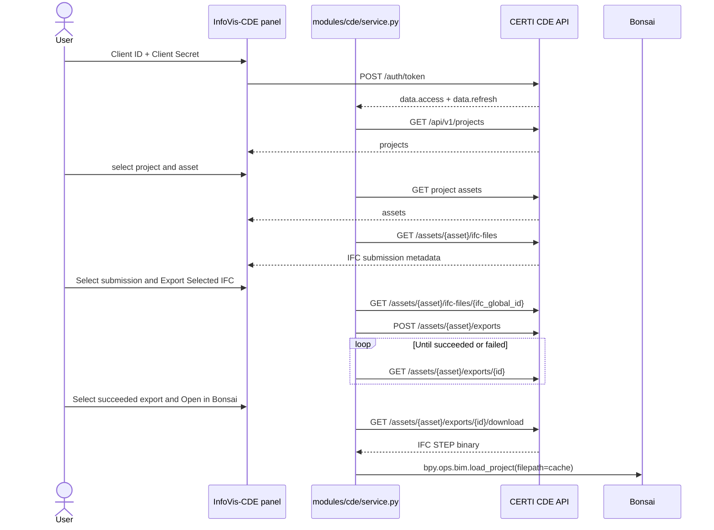

# CDE Integration

## Purpose

The `InfoVis-CDE` panel connects Blender to the CERTI Common Data Environment
(CDE), lets the user browse projects, assets, and IFC records, and opens a CDE
model through Bonsai without requiring the user to select a local IFC file.

The current test environment defaults to:

```text
http://cde.certi.api.br:8080
```

The endpoint is configurable in the panel.

## Requirements

- Blender 5.1 or newer
- Bonsai 0.8.5 installed and enabled
- network access allowed for the InfoVis extension
- a valid CDE `client_id` and `client_secret`

## Open an IFC from the CDE

1. Open the 3D View sidebar and select `InfoVis-CDE`.
2. Confirm the CDE URL.
3. Enter the `Client ID` and `Client Secret`.
4. Click `Connect`.
5. Select a project and click `Load Assets`.
6. Click `Load IFC Submissions` and select the IFC submission to export.
   The selected record is used as the source of the generated file.
7. In `Exports`, click `Export Selected IFC`.
8. Wait while InfoVis polls that export until it reaches `succeeded` or
   `failed`. The export area shows only the export returned for the currently
   selected IFC.
9. Click `Open in Bonsai`.
10. Wait while InfoVis downloads and opens the generated IFC. Use the refresh
    icon to reload previously generated exports at any time.

The status box reports authentication, query, export, download, and Bonsai
loading progress. The binary download runs outside Blender's UI thread.

The asset list and selected-asset details show the asset name, Global ID, and
type. The Global ID is the identifier used by subsequent IFC and export API
requests.

## CDE API Flow



### Endpoints Used

| Method | Endpoint | Purpose |
|--------|----------|---------|
| `POST` | `/auth/token` | Obtain JWT access and refresh tokens |
| `GET` | `/api/v1/projects` | List available projects |
| `GET` | `/api/v1/projects/{project_global_id}/assets` | List project assets |
| `GET` | `/api/v1/assets/{asset_global_id}/ifc-files` | List IFC submissions; not downloadable exports |
| `POST` | `/api/v1/assets/{asset_global_id}/exports` | Request an export of the asset's current CDE elements |
| `GET` | `/api/v1/assets/{asset_global_id}/exports` | List generated exports and check their status |
| `GET` | `/api/v1/assets/{asset_global_id}/exports/{id}` | Poll one generation request until completion |
| `GET` | `/api/v1/assets/{asset_global_id}/exports/{id}/download` | Download the generated IFC |

The export status can be `queued`, `running`, `succeeded`, or `failed`.

## Important Behavior

`/ifc-files` lists submissions uploaded to an asset. The user must select one of
these records before generating an export. InfoVis validates that selection with
`GET /ifc-files/{ifc_global_id}` and then requests the asset export using the
payload documented by the CDE (`{"force": false}`). It does not send the
unsupported `requested_source_ifc_file_id` field.

Downloadable artifacts are represented by `/exports`. InfoVis generates an
export, polls `/exports/{id}` until completion, and shows only that generated
entry. Changing the selected IFC clears the previous entry. Refresh retrieves
the displayed export directly by its UUID instead of loading the asset's full
export history. InfoVis downloads that export and passes the temporary IFC path
to Bonsai.

## Authentication and Security

- Credentials are sent only to `POST /auth/token`.
- The JWT is held in process memory and is not written into the source code.
- `Client Secret` is cleared from the UI immediately after successful login.
- CDE runtime properties use `WindowManager.cde_props`, separate from the
  IFC model state stored in `Scene.og_props`.
- `Disconnect` clears the session token and all lists shown in the panel.
- Production environments should use HTTPS. The current default uses HTTP
  because it is a test environment.

## Download Cache

Generated IFC files are downloaded atomically to the operating-system temporary
directory under `infovis_cde`. Data is first written with a `.part` suffix and
renamed only after the download completes. Bonsai requires a filesystem path,
so the cache is the bridge between the HTTP response and
`bpy.ops.bim.load_project`.

## Response Compatibility

The live API wraps some responses in `{"data": ...}`, while the OpenAPI schema
describes the inner value. The client accepts wrapped and unwrapped responses,
including direct lists and paginated objects with `results` and `next`.

For the binary download, InfoVis sends `Accept: */*`. This avoids HTTP 406 from
CDE deployments whose binary renderer differs from the media type advertised
by the OpenAPI schema.

## Troubleshooting

| Message or symptom | Action |
|--------------------|--------|
| `The CDE did not return an access token` | Reload the current extension version; JWT is read from `data.access` |
| `Invalid credentials or expired JWT session` | Confirm Client ID/Secret, reconnect, and retry |
| No projects or assets | Confirm the authenticated client has access to them |
| Export remains queued/running | Wait for CDE processing; generation monitoring times out after 10 minutes |
| Export failed | Review the error returned in the panel and validate the asset's canonical IFC state |
| HTTP 406 during download | Reload the current extension version, which uses `Accept: */*` |
| Bonsai cannot open the downloaded IFC | Confirm Bonsai is enabled and inspect the IFC export status in the CDE |
| `Open in Bonsai` is disabled | Select an export with status `succeeded` |
| Connection error | Check the URL, network permission, firewall, and CDE availability |

HTTP errors include the method and endpoint, for example:

```text
CDE responded HTTP 406 at GET /api/v1/assets/.../exports/.../download
```

Do not include credentials or JWT values when sharing diagnostic messages.

## Implementation Map

| File | Responsibility |
|------|----------------|
| `modules/cde/service.py` | JWT, HTTP requests, pagination, export polling/history, and atomic download |
| `modules/cde/properties.py` | Runtime connection state and project/asset/submission/export collections |
| `modules/cde/operators.py` | Login, queries, export generation, asynchronous download, and Bonsai opening |
| `modules/cde/panels.py` | `InfoVis-CDE` panel and UI lists |
| `tests/test_cde_service.py` | REST client unit tests |
| `tests/blender_cde_registration.py` | Blender registration smoke test |
